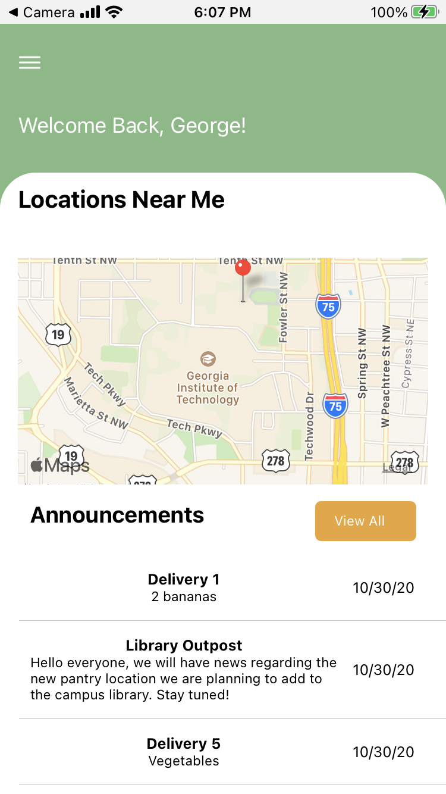

# Klemis Kitchen App
`Klemis Kitchen App` is a multiplatform React Native iOS and Android App allowing Georgia Tech Klemis Kitchen members to access inventory for different Klemis Kitchen pantry locations and view announcements posted by administrators.  
Created as part of Georgia Tech’s Junior Design class in collaboration with Klemis Kitchen.  
\


## 📝 Release Notes
Version 1.0  
New Features: Home Screen, Drawer, Locations, Announcements, and Inventory for every location  
Known Bugs: Login is not always working as expected, and on Android the status bar has extra padding when navigating out of the homescreen.

## 🚀 Usage
The app is (or will be soon) available on the iOS App Store and Google Play Store under the name `Klemis Kitchen`. First install `node.js` and `yarn` and clone the project from github. To run it locally for development, within the project directory use  
```
yarn install
yarn start
```
A browser window will open with the Expo dashboard. From there, you can choose to run the app in a browser window, or on an Android/iOS device via an emulator or the [Expo](https://expo.io/) app.

## 🔧 Configuration
The default (production) configuration of the app points to `api.klemis-kitchen.com` to retrieve pantry information from. This server runs `Klemis Kitchen API` on a Georgia Tech-hosted platform.  
To change where to fetch data from, edit `APIFETCHLOCATION` in `constants.tsx`

## ⛑️ Troubleshooting/FAQ
"I clicked on the login button, and nothing happened": The API may be down. Waiting 5-10 minutes and trying again may fix the issue.  
"I'm running the API locally, and when running the app in the browser nothing happens": You may be getting CORS errors. To fix this, you'll need to disable CORS Security measures in your browser either by getting the "CORS Everywhere" extension for Firefox or by running Chromium from the command line with the disable-web-security flag. Note that this is not recommended due to opening your browser up to attacks, so follow advice at your own risk.  
"I'm running the API locally, and after doing the above, I see results from the remote server": Make sure you've followed the instructions under the "Configuration" section of the guide.  
"I'm running the API locally, and when running the app on my phone, nothing works": Unfortunately, you cannot run the app on your phone with a local instance of the API in most normal scenarios. However, if you have the technical skills, you can run the API Docker container on your phone so that localhost still points to the correct location.
